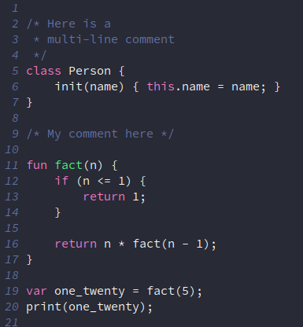

# Basic Syntax Highlighting Examples
Here is the general gist for adding simple syntax highlighting to my "Go To" text editors.

## NEOVIM


Create a file `~/.config/nvim/syntax/lox.vim` and put the text below in it.
> In order to activate the new syntax, run `:set syntax=lox`.
```vim
syntax match LoxString /".*"/
syntax region LoxComment start="/\*" end="\*/" contains=NONE
" \< means "start of a word"
" \ze means to match up to this point, but do not highlight
syntax match LoxFun /\<\w\+\>\ze\s*(/
syntax keyword LoxKeyword fun return var if else class this

highlight link LoxKeyword Keyword
highlight link LoxString String
highlight link LoxComment Comment
highlight link LoxFun Function
```


## Emacs


Create a file called `~/.emacs.d/lox-mode.el` and put this in
it. Then go to your `init.el` file and put `(load "~/emacs.d/lox-mode.el")` somewhere in it.

```lisp
;; mylang-mode.el
(defvar loxlang-keywords
  '("if" "else" "return" "fun" "var" "class")
  "Lox keywords.")

(defvar loxlang-font-lock-keywords
  `(
    (,(regexp-opt loxlang-keywords 'words) . font-lock-keyword-face)
    ("\\/\\*\\(.\\|\n\\)*?\\*\\/" . font-lock-comment-face)
    ("\\<fun\\s-+\\([a-zA-Z_][a-zA-Z0-9_]*\\)" 1 font-lock-function-name-face)
    )
  "Highlighting expressions for Lox mode.")

(define-derived-mode loxlang-mode prog-mode "loxlang"
  "Major mode for editing Lox source code."
  (setq font-lock-defaults '((loxlang-font-lock-keywords)))
  (setq font-lock-multiline t))

;; Associate .myl files with mylang-mode
(add-to-list 'auto-mode-alist '("\\.lox\\'" . loxlang-mode))

(provide 'loxlang-mode)
```

## VSCODE (TODO)
Have not yet tried to figure this out, but would like to.